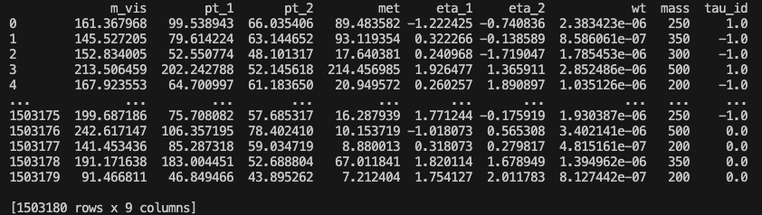

# INNFER - Invertible Neural Networks for Extracting Results

## Installing Repository and Packages

To import the github repository, clone with the following command.
```
git clone https://github.com/gputtley/INNFER.git
```

Then to set up the conda environment for running this repository run this command. You will need to click `enter` and `yes` through all prompts. For the conda installation license hit `q` to go the end of the file and then you can fit `enter`. 
```
source setup.sh
```
## Setup Environment

At the beginning of every session you will need to run the following command to setup the environment.
```
source env.sh
```

## Running INNFER

Running INNFER happens in 5 main stages:
* PreProcess
* Train
* ValidateGeneration
* ValidateInference
* Infer (not yet implemented)

Each of these steps are run through the `scripts/innfer.py` code, with the `--step` option matching the relevant stage of running. The ValidateInference and Infer steps are split into further sub-steps, with the `--sub-step` option, these are:
* InitialFit
* Scan
* Collect
* Plot

## Running from Benchmark

To initially setup the benchmark scenario data and config file, you can run the following command.
```
python3 scripts/innfer.py --step="MakeBenchmark" --benchmark="Gaussian"
```
This runs simple example of inferring the top mass from a mass resolution like variable. The INNFER workflow is then run with the following commands.
```
python3 scripts/innfer.py --step="PreProcess" --benchmark="Gaussian"
```
```
python3 scripts/innfer.py --step="Train" --benchmark="Gaussian" --architecture="configs/architecture/simple.yaml"
```
```
python3 scripts/innfer.py --step="ValidateGeneration" --benchmark="Gaussian"
```
```
python3 scripts/innfer.py --step="ValidateInference" --sub-step="InitialFit" --benchmark="Gaussian"
```
```
python3 scripts/innfer.py --step="ValidateInference" --sub-step="Scan" --benchmark="Gaussian"
```
```
python3 scripts/innfer.py --step="ValidateInference" --sub-step="Collect" --benchmark="Gaussian"
```
```
python3 scripts/innfer.py --step="ValidateInference" --sub-step="Plot" --benchmark="Gaussian"
```
There is no actual data to infer on in the benchmark scenarios, so this step can be skipped. As these jobs may take a some time, the jobs can be parallelised and submitted to a batch, such as on an SGE cluster, by adding `--submit="SGE"`. Running INNFER on a batch is highly recommended in all cases.

## Running from Dataset

To run from a dataset the input file must be a parquet file. The parquet file should be a flat datasets of X and Y variables (as well as weights) as columns and events as rows. The dataset should then looks something like this.



Alongside the parquet file, a yaml config file must be provided. This config should include all the relevant running options and the location of the parquet file. An example of how this should look is shown below.

```
name: ggHtoTauTauMass
files:
  susy_signal: data/susy_samples.parquet
  dy_background: data/dy_samples.parquet  
variables:
  - m_vis
  - pt_1
  - pt_2
  - met
  - eta_1
  - eta_2
pois:
  - mass
nuisances:
  - tau_id
preprocess:
  standardise: all
  train_test_val_split: 0.3:0.3:0.4
  equalise_y_wts: True
inference:
  rate_parameters:
    - susy_signal
  nuisance_constraints:
    tau_id: "Gaussian"
data_file:
  - data/susy_95_plus_bkg_sample.parquet
```

From this, the INNFER workflow can then be run with the same commands as in the benchmark case but replacing `--benchmark="Gaussian"` with `--cfg="configs/run/susy_example.yaml"`. The Infer step can be performed with the same commands as for ValidateInference but with `--step="Infer"`.

## Structure of Code

The code is built off of the several classes in the `python` directory. A brief explanation of each one is shown below.

### Batch
This class is used to submit the jobs to the requested cluster. This is currently only set up for an SGE cluster. TO DO: Add condor submission options.

### Benchmarks
This class includes the information of all benchmark scenarios. It can generate the datasets, provide the probability density function and make the yaml running config.

### DataLoader
This class is used to load in the dataset from a parquet file. It is set up to load in batches so not to exhaust the memory usage when training.

### InnferTrainer
This class is an extension of the BayesFlow Trainer class. It allows training from parquet files, as well as batch resampling.

### Likelihood
This class stores the likelihood. It can be used for scans and minimisation.

### Network
This class works with the BayesFlow amortizer class. It helps build and train the models, as well as return the probabilities of a given events and sampling to produce new datasets.

### PreProcess
This class preprocesses the input dataset. It returns datasets split by train, test and validation, as well as X, Y and wt. It will also perform any data transformations, such as standardisation, asked for in the running config.

### Validation
This class performs validation on the trained networks. It can create plots of synthetic vs simulated data, as well as drawing the likelihood scans for each required Y values.
